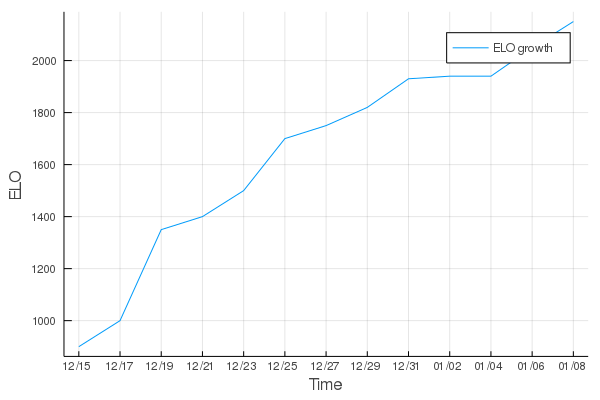

# GoneuraOu

Decent UCI Minishogi (5x5 shogi) Engine

Current Strength: Around **2150 ELO**

### ELO Growth


## Technology

Technologies used to build this engine: (crossed-out means in the future)

- Move Generation
    - Bitboards
    - Pre-generated pattern tables
    - Modified Kindergarten Bitboards for Slider attacks
    - Incremental Pawn Locations
    - Pawn drop mate detection

- Search
    - Negamax Search
    - Quiescence Search
    - Iterative Deepening
    - PVS Search
    - Null-Move Pruning
    - Check Extension
    - Razoring
    - Late-Move-Reduction (LMR)
    - Reverse Futility Pruning
    - Mate Distance Pruning
    - Transposition Table (a little buggy though...)
    - ~~SEE (Static Exchange Evaluation)~~
    - ~~MTD(f)~~


- Move Ordering
    - MVV-LVA
    - History Moves
    - Killer Moves
    - Second Killer Moves
    - Hash Move
    - ~~Checks~~

- Evaluation
    - Piece Values
    - Piece-square Table
    - King-Distance evaluation (inspired from Computer Shogi papers)
    - King Safety
    - Slider activity
    - King activity
    - Drop danger
    - ~~Pins~~
    - ~~NNUE for accurate evaluation~~

## Games

Games during development progress:

Jan 8 2022

Beats Fairy-Stockfish 2000 ELO in bullet (bullet 0.5+0)

```
[White "GoneuraOu"]
[Black "Fairy-Stockfish 2000 ELO"]
[Result "1-0"]
[TimeControl "40/30"]
[Variant "minishogi"]

1. Sb2 {+0.08/13 1.5s} Sb4 {+0.76/18 3.5s} 2. Bc2 {+1.76/13 1.4s}
Bc4 {+0.51/17 1.9s} 3. Rd1 {+1.76/11 1.3s} Be2 {+0.53/18 2.1s}
4. Rd2 {+1.65/12 1.3s} Bc4 {-0.23/17 2.8s} 5. Rd1 {+1.76/12 1.2s}
Be2 {+0.07/18 2.5s} 6. Rd2 {+1.65/12 1.1s} Bc4 {-0.38/16 0.87s}
7. Rd1 {+1.76/12 1.1s} Rc5 {0.00/18 2.2s} 8. Ba4 {+1.37/11 1.0s}
Be2 {+0.76/18 1.9s} 9. Rd2 {+1.57/13 0.97s} Pe3 {+0.23/16 0.63s}
10. Bc2 {+1.96/11 0.92s} Gc4 {-1.61/16 1.7s} 11. Gc1 {+3.43/12 0.88s}
Rd5 {-1.61/15 1.5s} 12. Rxd5 {+6.09/10 0.83s} Kxd5 {-2.07/15 0.17s}
13. R@e4 {+5.59/10 0.79s} R@e1 {-1.61/15 1.3s} 14. Rxe3 {+4.44/10 0.75s}
Gd4 {-1.07/14 0.86s} 15. Rxe2 {+3.88/10 0.71s} Rxe2 {-0.46/12 0.98s}
16. P@d3 {+5.93/8 0.68s} Gc3 {-1.69/14 0.84s} 17. Sxc3 {+7.75/9 0.64s}
Sxc3 {-7.30/11 0.24s} 18. G@d4 {+7.85/8 0.61s} Sxd4 {-9.46/11 0.35s}
19. Pxd4 {+8.90/8 0.58s} Ke5 {-10.76/11 0.65s} 20. B@c4 {+10.57/9 0.55s}
R@c5 {-8.30/10 0.54s} 21. Bxe2 {+18.50/9 0.52s} S@e4 {-22.84/13 0.45s}
22. S@c4 {+22.62/9 0.50s} Rxc4 {-M22/10 0.37s} 23. R@a5 {+22.61/9 0.47s}
S@c5 {-17.23/9 0.15s} 24. Bxc4 {+29.62/10 0.45s} Kxd4 {-M18/15 0.17s}
25. Bb5+ {+28.16/8 0.43s} G@c4 {-M10/13 0.090s} 26. R@e1 {+29.77/8 0.41s}
Kd5 {-M10/13 0.071s} 27. +Bxc4 {+M7/9 0.070s} Kxc4 {-M6/32 0.027s}
28. Rxe4 {+M5/7 0.30s} Kd5 {-M4/157 0.037s} 29. G@d4 {+M1/3 0.002s, Sente mates}
1-0
```

Jan 7 2022

Defeats Fairy-Stockfish 1900 ELO (blitz 2+1):

```
[White "Fairy-Stockfish 1900 ELO"]
[Black "GoneuraOu"]
[Result "0-1"]
[TimeControl "40/120+1"]
[Variant "minishogi"]

1. Gb2 {+0.05/24 19s} Sd4 {+0.21/14 7.0s} 2. Bb3 {+1.00/19 3.9s}
Bc4 {-0.13/13 6.7s} 3. Bc2 {+0.06/23 17s} Rb5 {+0.53/13 6.4s}
4. Rd1 {-0.07/23 14s} Rc5 {+0.83/14 6.2s} 5. Ba4 {+0.53/22 14s}
Be2 {+0.86/14 5.9s} 6. Re1 {-0.30/19 5.1s} Bb5 {+0.86/14 5.7s}
7. Bxb5+ {-0.53/23 12s} Rxb5 {+1.18/12 5.4s} 8. B@e2 {-2.30/20 11s}
Ra5 {+3.03/12 5.2s} 9. Sc2 {-2.00/19 6.4s} Pe3 {+2.37/12 5.0s}
10. Sb3 {-1.76/18 8.7s} Pxe2 {+8.01/12 4.8s} 11. Rxe2 {-4.16/17 7.6s}
B@e4 {+7.77/10 4.6s} 12. Sb4 {-4.53/16 6.6s} Ra4 {+8.95/11 4.4s}
13. Sa3 {-7.07/17 5.7s} Rc4 {+11.41/11 4.2s} 14. Re1 {-11.61/15 3.2s}
B@d2 {+13.29/12 4.1s} 15. Rd1 {-10.61/15 1.4s} Bc1+ {+17.31/13 3.9s}
16. P@e3 {-M14/30 0.91s} +Bxd1 {+21.07/13 3.8s} 17. Pxe4 {-M14/41 0.44s}
Gxe4 {+23.96/12 3.6s} 18. Gb1 {-M12/31 0.64s} R@c1 {+M11/11 0.75s}
19. B@d3 {-M8/45 0.51s} Sxd3 {+M7/7 0.010s} 20. Sa4 {-M6/109 0.49s}
B@d4 {+M1/4 0.001s, Gote mates} 0-1
```

Finds forced checkmate in 14 (halfmoves) against Fairy-Stockfish 1800 ELO: (blitz 3+2)

```
[White "GoneuraOu"]
[Black "Fairy-Stockfish 1800 ELO"]
[Result "1-0"]
[TimeControl "40/180+2"]
[Variant "minishogi"]

1. Sb2 Bd3 2. Gc2 Gd4 3. Sc3 Bxc2
4. Sxd4 Sxd4 5. Bxc2 S@b2 6. Kxb2 G@c3
7. Kc1 Rb5 8. Rxe4 Kd5 9. B@b3 Rxb3
10. Bxb3 B@c4 11. S@e3 Gd2 12. Kb1 Gc1
13. Kxc1 Sc5 14. Bxc4 Sxc4 15. G@d4 { Checkmate } 1-0
```

Slowly improves position to +4 and defeats Fairy-Stockfish level 5 in 16 moves: (blitz 3+2)

```
[White "Fairy-Stockfish Level 5"]
[Black "GoneuraOu"]
[Result "0-1"]
[TimeControl "30/180+2"]
[Variant "minishogi"]

1. Sd2 Sd4 2. Bc2 Bc4 3. Rc1 Rb5
4. Rd1 Bb3 5. Sc1 Bxc2 6. Gxc2 B@a4
7. B@b2 Rxb2 8. Kxb2 B@c3 9. Kb1 Bxc2
10. Kxc2 Ba1+ 11. B@b4 +Bxa2 12. R@a3 +Bxa3
13. Rxd4 G@b3 14. Kd2 +Bxc1 15. Ke1 S@e2
16. Kxe2 R@e3 { Checkmate } 0-1
```

Defeats Fairy-Stockfish level 4 in 11 moves: (blitz 3+2)

```
[White "Fairy-Stockfish Level 4"]
[Black "GoneuraOu"]
[Result "0-1"]
[TimeControl "40/180+2"]
[Variant "minishogi"]

1. Sc2 Sd4 2. Gb2 Gc5 3. Sc3 Sxc3
4. Gxc3 S@d2 5. S@b4 Sxe1+ 6. Bb3 Gxb4
7. Gxb4 Bd3 8. G@b1 S@c3 9. Gc1 R@b1
10. Gxb1 Bxb1+ 11. Kxb1 G@b2 { Checkmate } 0-1
```

Defeats Fairy-Stockfish level 3 in 24 moves: (bullet 0.5+2)

```
[White "GoneuraOu"]
[Black "Fairy-Stockfish Level 3"]
[Result "1-0"]
[TimeControl "40/30+2"]
[Variant "minishogi"]

1. Sb2  Bd3  2. Gc2 Bc4  3. Gb3  Bd3 
4. Ga4  Rxa4  5. Bxa4 G@b4  6. R@a5  Sd4 
7. Rc1  Pe3  8. Bd1 Ke4  9. Sb3  Gb5 
10. Ra3+  Gbc5  11. +Rb2 Gcc4  12. Sc2  Ke5 
13. Sxd3  Gxd3  14. B@a5 S@c3  15. Rxc3  Gxc3 
16. +Rxc3  R@b5  17. Bb4+ Rxb4  18. +Rxb4  B@d2 
19. +Rb5  Be1+  20. G@c4 +Bc3  21. Gxc3  Pe2 
22. +Rxd5  Kxd5  23. G@c4 Ke5  24. G4xd4 { Checkmate } 1-0
```
